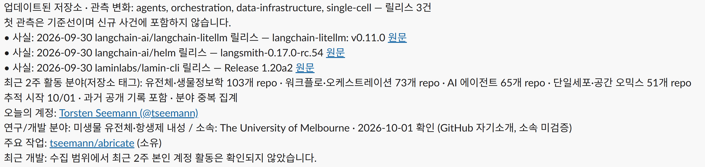

# Pakuri · Star-seeker

[](https://github.com/ehojune/Pakuri/actions/workflows/tests.yml)
[](LICENSE)
[](pyproject.toml)


좋은 개발자의 발자취를 읽고 다음에 만들 것을 찾는다.

AI agent·생물학·생물정보학 개발자의 **공개 GitHub 활동**에서 주제와 개발 방식을 배운다. 새 저장소·커밋·push·릴리스를 날짜와 원문 링크로 모은다. ‘Pakuri’는 참고해 온다는 뜻, ‘Star-seeker’의 별은 배울 만한 개발자와 프로젝트를 뜻한다. GitHub star 수로 순위를 매기지 않는다.


## 관측 결과 예시

[](docs/assets/observed-activity-example.png)

2026-10-01 kuromi 출력 예시. 첫 관측은 기준선으로 표시하고 소속이 미확인이면 그 상태를 함께 보여준다.

## 시작

Python 3.12와 GitHub CLI가 있는 Windows PC에서:

```powershell
gh auth status
python -m pakuri collect --config targets.json --output data/latest.json --hours 24
python -m pakuri report --input data/latest.json
python -m unittest discover -s tests -v
```

인증은 `GITHUB_TOKEN`/`GH_TOKEN` 또는 로컬 `gh auth token`을 쓴다. 토큰은 저장하지 않는다. `targets.json`은 개인 34명·조직 16개·지정 저장소 44개의 참고 지도다. 계정 확인과 현재 소속 확인을 구분한다. [선정·검증 근거](docs/reference/identities.md)

### 나만의 별 고르기

‘좋은 개발자’ 목록은 바꿔 쓰는 기본 예시다. [targets.json](targets.json)의 `people`·`organizations`에서 `login`, 최상위 `repositories`에서 `full_name`(`owner/repo`)을 추가·삭제하면 된다. `topics`·`relevance`도 내 관심사에 맞게 바꾼다.

별도 파일을 쓰려면 `targets.json`을 복사한 뒤 다음처럼 실행한다. 예약 수집은 `targets.json`을 사용한다.

```powershell
python -m pakuri collect --config my-targets.json --output data/latest.json --hours 24
```

## 별의 발자취 읽기

| 기록 | 의미 |
|---|---|
| 새 저장소 | 생성 시각과 원문 링크. 오래된 저장소를 처음 발견한 것은 기준선 |
| push | 공개 이벤트 시각·브랜치·head 링크 |
| commit | 선택한 저장소의 기본 브랜치 커밋 시각·SHA 링크 |
| release | 공개 릴리스 발행 시각·원문 링크 |
| 첫 관측 | `baseline:true`; 신규 활동 브리핑에서 제외 |

보고 순서는 **분야 관측 → 무엇이 바뀌었나(사실) → 참고 제안 → 내 프로젝트 참고 후보**다. 프로젝트 관련성이 없어도 중요한 활동을 보여준다. 제목만으로 성능 향상이나 업계 전체 추세를 주장하지 않는다.

저장된 SQLite 상태로 중복과 늦게 도착한 이벤트를 다룬다. `coverage`/`errors`에는 조회 범위·페이지 제한·실패·API 한도를 남긴다. 공개 이벤트는 최대 300건·30일이며 최대 6시간 늦을 수 있다. 기본 브랜치 외 커밋과 선택 한도 밖 저장소는 완전 수집을 보장하지 않는다. [API·연결 규격](docs/reference/contract.md)

## kuromi와 운영

Claude Code와 Slack 기반 AI 비서 kuromi가 궁금하다면 [공개 저장소](https://github.com/ehojune/kuromi)를 참고하면 된다.

로컬 kuromi의 `.env`에 `PAKURI_PATH`를 이 폴더의 절대 경로로 지정한다. `pakuri_activity`는 캐시를 읽는다. 조회는 발송 기록을 소비하지 않는다. 아침 브리핑은 포함한 ID만 Slack 전송 성공 뒤 기록한다.

```powershell
powershell -NoProfile -ExecutionPolicy Bypass -File scripts/install_schedule.ps1
Get-ScheduledTask -TaskName Pakuri-Collect
```

매시간 및 로그인 때 수집한다. PC가 켜져 있고 해당 사용자가 로그인한 동안 동작하며, 놓친 실행은 켜진 뒤 재개한다. 로그와 상태는 `data/`에 있다. 중지: `Disable-ScheduledTask -TaskName Pakuri-Collect`.

코드·참고 지도·검증 근거·kuromi 연결 방식을 MIT로 공개한다. 인증·수집 결과·발송 기록은 로컬에 둔다. kuromi의 별도 AI 뉴스 작업은 독립적으로 진행한다.

[MIT](LICENSE) · [다음 할 일](NEXT.md) · [결정 기록](DECISIONS.md) · [실행 검증](docs/reference/validation.md) · [프로젝트 참고 근거](docs/reference/project-context.md)
